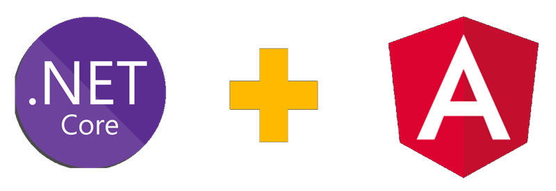

# StefaniniChallenge

> Projeto desenvolvido para demonstrar meu conhecimento em API REST em .NET Core e aprendizado em Angular. O Projeto foi desenvolvido em .NET Core 6/Angular 14 como
desafio para uma vaga de desenvolvedor .NET Core na Stefanini;

### Tarefas

O projeto contém os seguintes recursos:

Categoria:
- [x] APIs (.NET Core);
- [x] Swagger configurado;
- [x] Migration (SQL Server);
- [x] Front-end CRUD (Angular);

## 📝 Licença

Esse projeto não está sob licença, podendo ser utilizado como objeto de estudo. Projeto para demonstração de conhecimento em .NET Core WebAPI REST.
